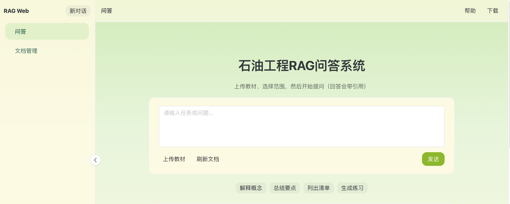

# 石油工程RAG 问答 Web 应用

技术栈：
- 前端：Vue 3 + TypeScript + Vite + Naive UI
- 后端：FastAPI + PostgreSQL（pgvector）+ LangChain/LangGraph（后续链路）
- LLM：OpenAI 兼容通道 + Ollama（MVP），可扩展 Anthropic 等

## 目录
- [docs/PRD.md](./docs/PRD.md)
- [docs/API.md](./docs/API.md)
- [docs/DB.md](./docs/DB.md)
- [docs/Acceptance.md](./docs/Acceptance.md)

## 本地启动（MVP）

### 1) 启动后端
1. 创建虚拟环境并安装依赖：
   - `python -m venv .venv`
   - `source .venv/bin/activate`
   - `pip install -r backend/requirements.txt`
2. 准备 PostgreSQL，并创建数据库与扩展：
   - 创建数据库（示例）：`rag_web`
   - 开启扩展：`CREATE EXTENSION IF NOT EXISTS vector;`
3. 配置环境变量（示例见 `backend/.env.example`），然后启动：
   - `uvicorn app.main:app --reload --port 8000 --app-dir backend`

### 2) 启动前端
1. `cd frontend`
2. `npm install`
3. `npm run dev`

前端默认通过 Vite proxy 访问后端：`/api -> http://localhost:8000/api`

## LLM 配置
后端通过统一的 `openai_compat` 通道对接多家“OpenAI 兼容”接口（OpenAI / DeepSeek / Qwen 等），以及 `ollama` 本地模型。

- OpenAI/兼容接口：
  - `OPENAI_COMPAT_BASE_URL`：例如 `https://api.openai.com/v1`（也可替换为 DeepSeek/Qwen 的兼容地址）
  - `OPENAI_COMPAT_API_KEY`：对应的密钥
  - `DEFAULT_LLM_MODEL`：对话模型名
  - `EMBEDDINGS_MODEL`：向量模型名（建议固定一种，避免维度不一致）
- Ollama：
  - `OLLAMA_BASE_URL`：默认 `http://localhost:11434`
  - `OLLAMA_MODEL`：对话模型名（例如 `qwen2.5:7b-instruct`）
  - `EMBEDDINGS_PROVIDER=ollama` 时，使用 `EMBEDDINGS_MODEL` 走 `/api/embeddings`
